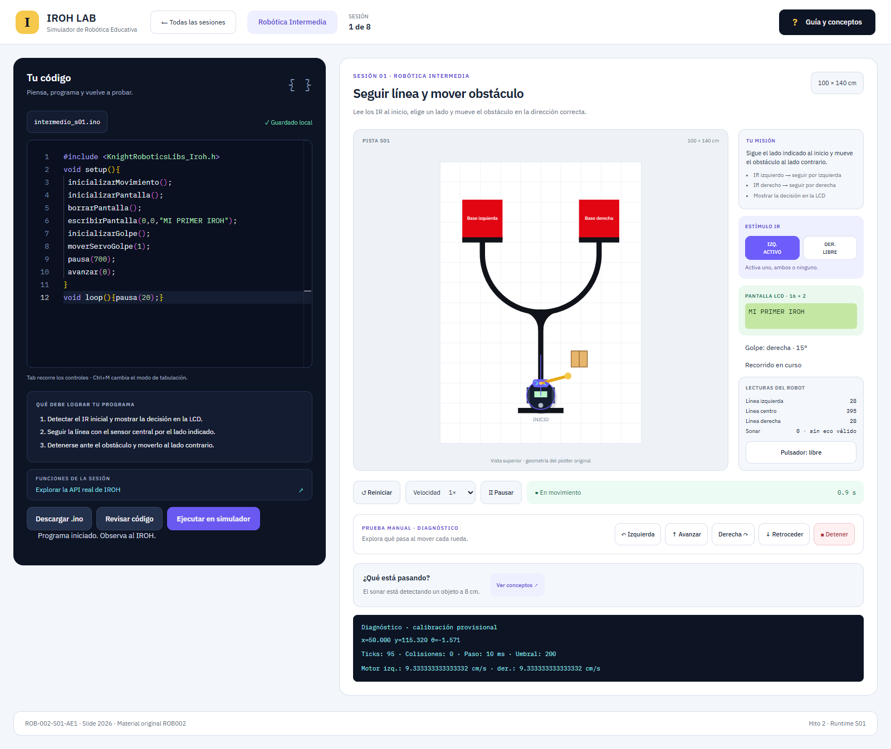
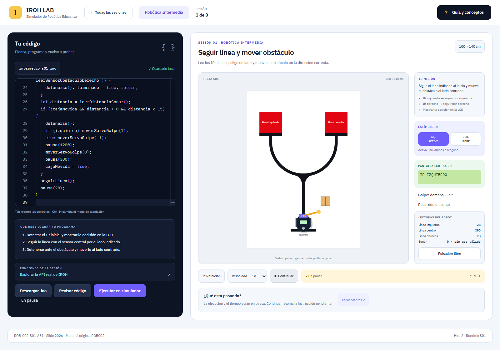
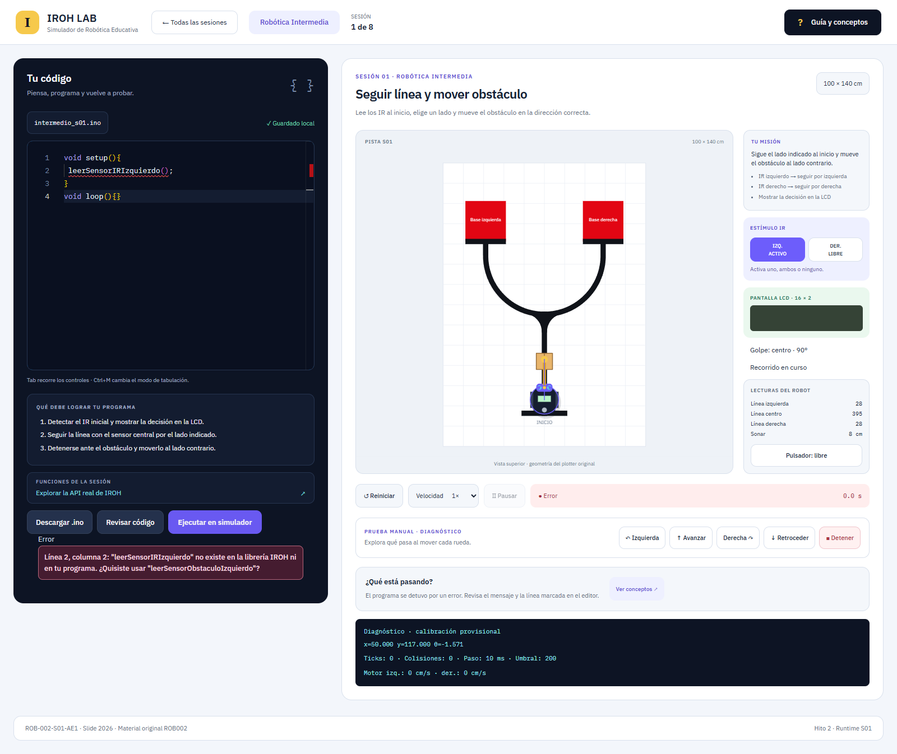
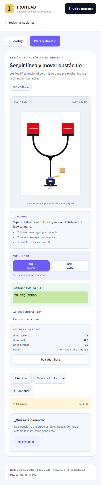

# Entrega del hito 2 · Runtime S01

Fecha de validación: 16 de septiembre de 2026.

## Implementado

S01 ejecuta el programa del estudiante desde Monaco dentro del Worker existente: tokenizer → parser/AST con posiciones → intérprete cooperativo → adapter IROH → motor físico. Se mantienen stack, diseños de referencia y contenido de S02–S08.

Revisar/ejecutar, marcadores de error, persistencia y descarga; setup/loop, funciones y ámbitos, operadores y ciclos; motores y freno de 70 ms; sensores, mayoría IR y sonar; LCD 16×2, backlight y pulsador; servo animado, golpe y caja móvil; pausa, continuación, reset y velocidad; eventos y feedback; controles manuales solo en debug. La vista móvil cambia a pista al ejecutar y a editor ante un error.

Las referencias izquierda y derecha resuelven la pista usando la API pública: leen IR, muestran la decisión, siguen el borde con el sensor central, detectan la caja, la golpean al lado contrario y llegan a su base. La prueba activa ambos IR después de llegar y verifica la detención. El motor no entrega la solución ni termina automáticamente por llegar.

## Validación ejecutada

| Comando | Resultado |
|---|---|
| `pnpm test` | 79/79 pruebas, 7 archivos; incluye las 26 regresiones originales y ambas referencias completas |
| `pnpm test:e2e` | 6/6 pruebas en Microsoft Edge; escritorio, móvil, Monaco, errores, movimiento, pausa, continuación, reset y persistencia |
| `pnpm build` | TypeScript y Vite correctos; 659 módulos |

Los tests son deterministas con ProgramRuntime.step(ms). El Worker usa el mismo avance y convierte tiempo real según velocidad. Un while infinito excede el presupuesto, detiene motores y permite reiniciar desde la UI. Los fixtures de referencia permanecen fuera de public y dist.

Se revisaron visualmente las capturas finales. Se corrigió un crecimiento del Canvas causado por el tamaño intrínseco del bitmap dentro de la cuadrícula; una prueba protege los límites de altura. No hubo errores de JavaScript en el flujo E2E de ejecución.

## Fidelidad

**Lógica replicada:** nombres reales y sobrecargas; velocidades con PWM base; cambios de modo y freno de 70 ms; pausa sin detener motores; sonar 0 sin eco y a ≤5 cm; mayoría de tres muestras IR; LCD sin borrado implícito y mensaje inicial; servo -1/0/1; finPrograma limpio; botón cooperativo.

**Física provisional:** velocidad máxima 28 cm/s, separación de ruedas 12 cm, radio 7 cm, ADC blanco28/negro395, brazo de 14 cm con pivote a 6 cm, 300°/s, impulso 60 cm/s y amortiguación 3/s. Caja y posición de salida son configuración de laboratorio. No se certifica precisión mecánica ni comportamiento idéntico sobre un robot real.

## Limitaciones conocidas

- Subconjunto educativo de C++, sin clases, punteros, arrays generales, librerías adicionales, macros ni ejecución JavaScript.
- Tipos numéricos internos no reproducen overflow AVR; floats de 64 bits y argumentos int sin todas las conversiones implícitas de C++.
- IR manual; tres muestras instantáneas, sin contabilizar intervalos de 200 µs. Sonar por rayo frontal, sin cono ni paredes.
- Colisión del cuerpo rígida; solo el servo impulsa la caja. Contacto del brazo aproximado, sin dinámica general ni masa medida.
- Paso de tiempo 10 ms. Texto LCD recortado a ventana visible; cursor inválido y servo fuera de rango generan diagnóstico pedagógico.
- Revisar verifica sintaxis, nombres de función y aridad. Otros errores se detectan al ejecutar la ruta correspondiente.
- El editor Monaco es un módulo pesado, cargado por demanda y servido localmente. S02–S08 siguen sin runtime físico.
- El optimizador de desarrollo de Vite puede fallar por permisos sobre ancestros en este entorno Windows. Producción, pruebas y servidor local están verificados; ver README.

## Archivos nuevos

- `src/simulator/runtime/IrohRuntimeAdapter.ts`
- `src/simulator/runtime/Movement.ts`
- `src/simulator/runtime/ProgramRuntime.ts`
- `src/simulator/runtime/interpreter/Environment.ts`
- `src/simulator/runtime/interpreter/Interpreter.ts`
- `src/simulator/runtime/interpreter/RuntimeError.ts`
- `src/simulator/runtime/interpreter/operators.ts`
- `src/simulator/runtime/parser/Parser.ts`
- `src/simulator/runtime/parser/ast.ts`
- `src/simulator/runtime/parser/validate.ts`
- `src/simulator/runtime/runtime-limits.ts`
- `src/simulator/runtime/runtime-types.ts`
- `src/simulator/runtime/signatures.ts`
- `src/simulator/runtime/tokenizer/Tokenizer.ts`
- `src/simulator/runtime/tokenizer/tokens.ts`
- `src/simulator/actuators.ts`
- `src/simulator/finish.ts`
- `src/simulator/LearningFeedbackEngine.ts`
- `src/tests/runtime/execution-budget.test.ts`
- `src/tests/runtime/helpers.ts`
- `src/tests/runtime/interpreter.test.ts`
- `src/tests/runtime/iroh-adapter.test.ts`
- `src/tests/runtime/parser.test.ts`
- `src/tests/runtime/s01-reference.test.ts`
- `src/tests/runtime/tokenizer.test.ts`
- `src/tests/reference-programs/infinite-loop.cpp`
- `src/tests/reference-programs/lcd.cpp`
- `src/tests/reference-programs/pause.cpp`
- `src/tests/reference-programs/s01-left.cpp`
- `src/tests/reference-programs/s01-right.cpp`
- `tests/e2e/runtime.spec.ts`
- `docs/hito2-runtime-s01.md`
- `docs/entrega-hito2.md`
- `docs/capturas/*.png`

## Archivos modificados

- `src/simulator/types.ts`
- `src/simulator/SimulationEngine.ts`
- `src/simulator/worker/simulator.worker.ts`
- `src/simulator/renderer/CanvasRenderer.ts`
- `src/features/simulator/Simulator.tsx`
- `src/features/simulator/useSimulation.ts`
- `src/features/simulator/Arena.tsx`
- `src/features/code-editor/CodeEditor.tsx`
- `src/features/session-explorer/Explorer.tsx`
- `src/content/api.ts`
- `src/styles/global.css`
- `README.md`
- `docs/iroh-api.md`
- `docs/fuentes-y-decisiones.md`

## Capturas

### Código ejecutándose

### LCD activa

### Caja movida

### Error de compilación

### Vista móvil

